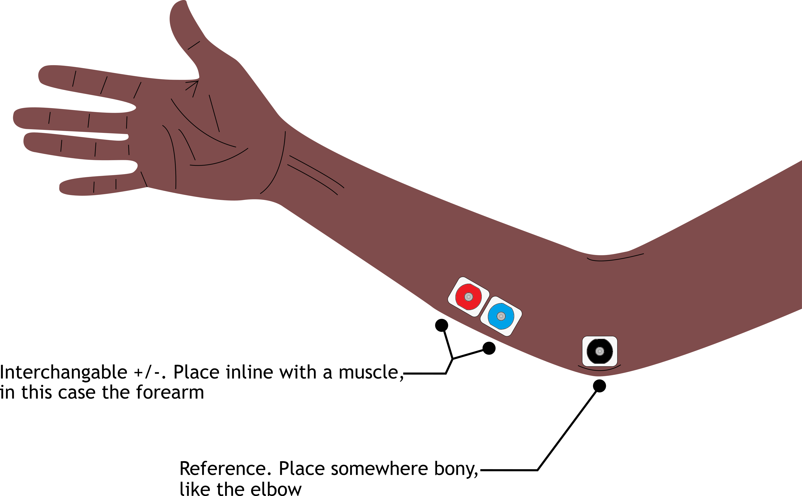

<iframe width="711" height="400" src="https://www.youtube.com/embed/o1aakhfO18Y" title="FANTM DEVLPR Shield Intro" frameborder="0" allow="accelerometer; autoplay; clipboard-write; encrypted-media; gyroscope; picture-in-picture" allowfullscreen></iframe>

## Overview

Congratulations on landing a FANTM DEVLPR! Getting started is simple: plug it right into your Arduino and double-check the "Key Points" to confirm everything is ready to go.

Once the hardware is ready, go to <InternalLink to="/DEVLPR/software/libdevlpr">the supporting Arduino library</InternalLink> to start programming away.

## Key Points

There are two parts to getting started with the DEVLPR hardware. The first is the board itself and the second is connecting it to your muscle. This section will address both.

### The DEVLPR

 

### Attaching Electrodes

The standard snap electrode cable we ship has 3 wires, red (+), blue (-), black (reference). Be sure
to check your cable manufacturer's website if you bought your own.

 
